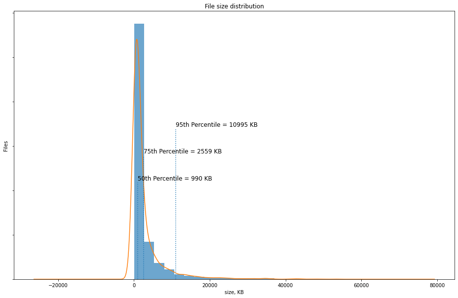
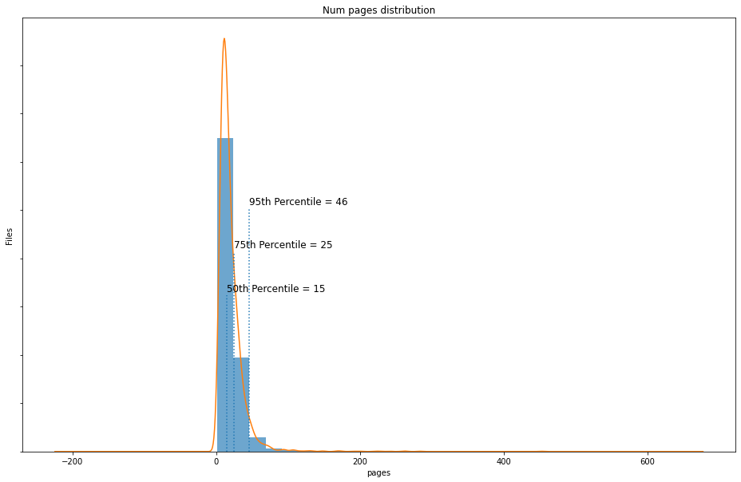
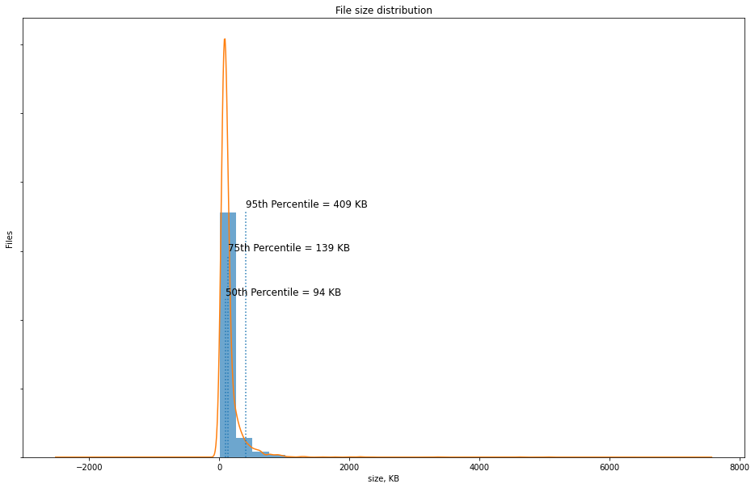
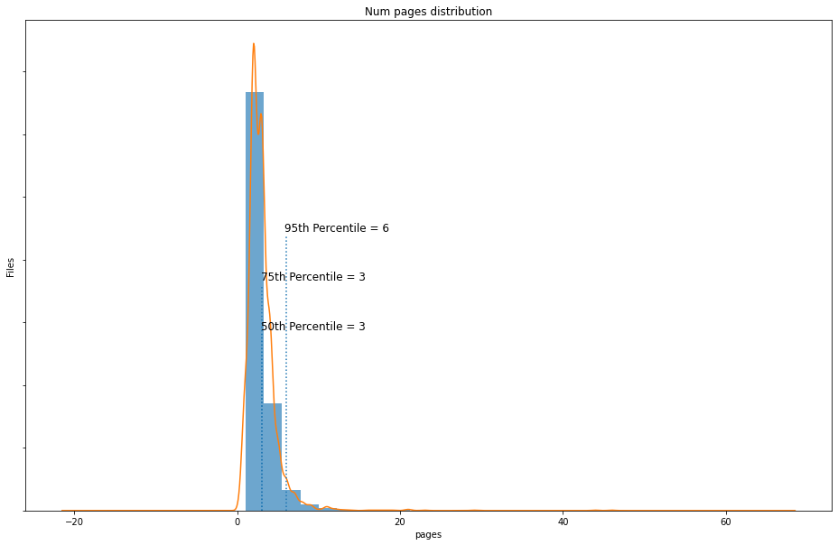
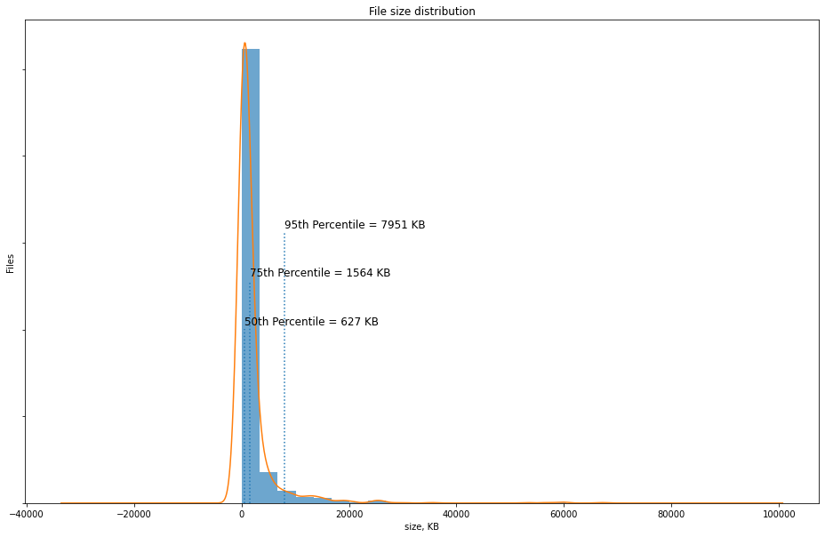
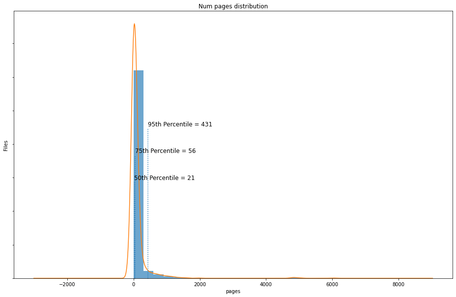

Exploratory Data Analysis
-------------------------

Grobid2 was tested against 3 datasets. Here we provide the brief description of
each one. Exploratory data analysis was performed using `pypdf2
<https://github.com/mstamy2/PyPDF2>`_ library.

arxiv
~~~~~

``arxiv`` dataset is a collection of 3646 scientific papers of different areas
from arXiv.org for the year 2021. Collection contains 9.7 GB of data. While
dataset consists of 3646 documents, analysis failed for various reasons on 40
documents, thus we managed to analyze only 3606 documents, which is 98.9%.
Documents have size from 45.8 KB to 52.9 MB with the average size of the
document 2.7 MB and the standard deviation of 4.8 MB. 50% of the pdf documents
in the dataset fall under 990.3 KB, 75% of the documents are under 2559 KB and
the 95th percentile is almost 11 MB

These documents contain 19.8 pages in average, with the smallest document of 1
page and the largest one of 452 pages. 50% of the documents have 15 pages or
less and the 95% of the documents have 46 or less pages.

2711 of 3606 analyzed documents are outlined and the rest 24.8% of documents
does not have the outline in them.

As for the document creator (i.e. tool which was used to generate them), we
have the following distribution

+-----------------------------------------------------+------+-------+
| LaTeX with hyperref                                 | 2968 | 82.3% |
+-----------------------------------------------------+------+-------+
| TeX                                                 | 87   | 2.4%  |
+-----------------------------------------------------+------+-------+
| Microsoft® Word 2016                                | 53   | 1.5%  |
+-----------------------------------------------------+------+-------+
| dvips(k) 2020.1 Copyright 2020 Radical Eye Software | 51   | 1.4%  |
+-----------------------------------------------------+------+-------+
| Word                                                | 34   | 0.9%  |
+-----------------------------------------------------+------+-------+
| Other (share <1%)                                   | 413  | 11.5% |
+-----------------------------------------------------+------+-------+

Most of documents in the ``arxiv`` dataset do not have page layout defined.

.. code-block::

   Document layouts analysis
   /OneColumn         31
   /TwoColumnLeft      3
   /SinglePage         2
   /TwoColumnRight     1

cv
~~

``cv`` dataset is a collection of various curriculum vitae found on the
Internet. Dataset was retrieved from `arefinnomi/curriculum_vitae_data
<https://github.com/arefinnomi/curriculum_vitae_data>`_ repository on GitHub.
EDA was successfully performed for 3247 of 3264 (99.5%) documents. The overall
dataset size is 455.10 MB.

CV documents are 142.4 KB average size with the standard deviation of 204 KB
with the smallest document taking 6.7 KB of data and the largest one taking 5 MB
of disk space. 50% of the documents are under 94.6 KB, 75% of the dicuments are
under 139.7 KB and the 95% percentile of the document size is 409 KB

As for the page count, average document has 3 pages (which to be honest was a
surprise, we expected the average size of document in this dataset to be 1 or 2
pages), with the standard deviation of 2 pages. Documents have from 1 up to 46
pages each. While 50% and 75% of documents are 3 or less pages long, 95%
percentile is 6 pages.

Document creators analysis showed that most of documents were generated using
software identified by the string ``Writer``:

+------------------------------+------+-------+
| Writer                       | 2295 | 70.7% |
+------------------------------+------+-------+
| Microsoft® Word 2010         |  121 | 3.7%  |
+------------------------------+------+-------+
| PScript5.dll Version 5.2.2   |  110 | 3.4%  |
+------------------------------+------+-------+
| Microsoft® Word 2013         |  105 | 3.2%  |
+------------------------------+------+-------+
| Microsoft® Office Word 2007  |   72 | 2.2%  |
+------------------------------+------+-------+
| Other (less that 2.2% each)  | 544  | 16.8% |
+------------------------------+------+-------+

Most of the documents do not specify any specific layout and only 29.9% (895) of
documents gave outline defined.

.. code-block::

   Document layouts analysis
   /OneColumn     96
   /SinglePage     4

tech
~~~~

Tech dataset consists of various technical manuals and books on software
engineering and related topics. Some of the titles are:

- Introspection for C and its Applications to Library Robustness
- Building R Packages - An Introduction.pdf
- High Speed Hashing for Integers and Strings - 2020 (1504.06804).pdf
- Dynamic Storage Allocation - A Survey and Critical Review.pdf
- Fibre Channel Fundamentals.pdf

We were able to successfully explore 1394 of 1477 documents while the
exploration of 83 documents (which is 5.6%) failed due to different errors in
the parsing library. The most common error was ``the file was not decrypted``,
which means that this dataset contains encrypted files. These 3.08 GB of files
were obtained from `tpn/pdfs <https://github.com/tpn/pdfs>`_ GitHub repository.

Average file size in the ``tech`` dataset is 1957 KB (approx 2 MB) with the
standard deviation of 4.9 MB. The smallest file is 17.2 KB and the largest is
67.1 MB. 50th percentile is 627.5 KB, 75th percentile is 1.6 MB and 99th
percentile is 7.95 MB.

Documents have from 1 to 6018 pages with the mean value of 103.6 pages and the
standard deviation of 378.6 pages. 50th percentile is 21 pages and 95th
percentile is 431 page.

481 of 1394 analyzed documents are outlined and the rest 65.5% of documents
does not have the outline in them.

As for the document creator (i.e. tool which was used to generate them), we
have the following distribution:

+------------------------------+-----+-------+
| LaTeX with hyperref package  | 234 | 16.8% |
+------------------------------+-----+-------+
| TeX                          | 159 | 11.4% |
+------------------------------+-----+-------+
| PScript5.dll Version 5.2.2   |  44 | 3.2%  |
+------------------------------+-----+-------+
| Microsoft® PowerPoint® 2010  |  37 | 2.7%  |
+------------------------------+-----+-------+
| FrameMaker 10.0.2            |  24 | 1.7%  |
+------------------------------+-----+-------+
| Other                        | 896 | 64.2% |
+------------------------------+-----+-------+

Only 79 of 1394 documents have layouts defined, which is 5.7% of all the
documents in this dataset.

.. code-block::

   Document layouts analysis
   /SinglePage        56
   /OneColumn         21
   /TwoPageRight       1
   /TwoColumnRight     1
